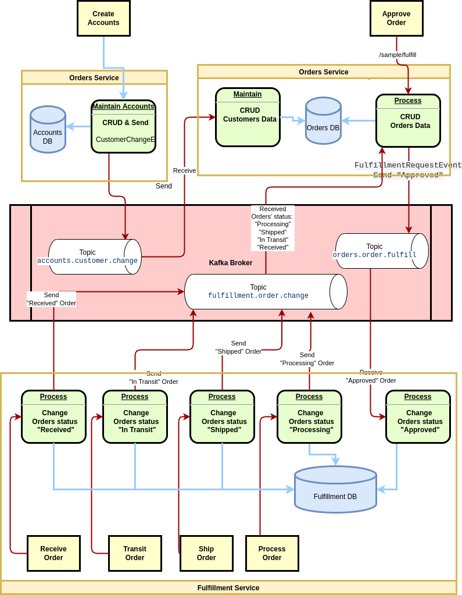
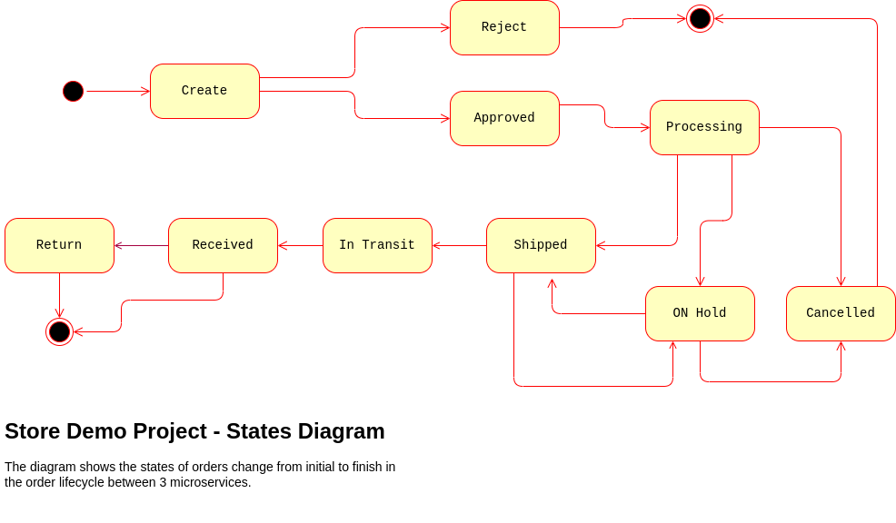

# Getting Started
### kafka-storefront-demo1 project
### Description
* ref. link: 
  Eventual Consistency with Spring for Apache Kafka: Part 1 of 2 & Part 2
  https://itnext.io/eventual-consistency-with-spring-for-apache-kafka-cfbbed450b5e
  https://itnext.io/eventual-consistency-with-spring-for-apache-kafka-part-2-of-2-23bedd512ccf

* Overview
  
* Sub-projects
  - store-demo-account1 project - Accounts service
  - store-demo-order1  project - Orders service  
    

* ordering process diagram - 
  An abridged view of the storefront ordering process is shown in the diagram below. The arrows represent the exchange of data. Kafka will serve as a means of decoupling services from one another while still ensuring the data is distributed.
  

* event flows of services -
  The diagram below shows the event flows between sub-systems discussed in the post. The numbering below corresponds to the numbering in the ordering process above. We will look at three event flows 2, 5, and 6. We will simulate event flow 3, the order being created by the Shopping Cart service.
  

### Diagrams
* State Change Event Messaging Flows - 
  There are three state change event messaging flows illustrated in this post.
  - Changes to a Customer triggers an event message produced by the Accounts service, which is published on the accounts.customer.change Kafka topic and consumed by the Orders service;
  - Order Approved triggers an event message produced by the Orders service, which is published on the orders.order.fulfill Kafka topic, and is consumed by the Fulfillment service;
  - Changes to the status of an Order triggers an event message produced by the Fulfillment Service, which is published on the fulfillment.order.change Kafka topic, and is consumed by the Orders service;
  
* Each of these state change event messaging flows follows the same architectural pattern on the Kafka topic’s producer and consumer sides.
  
  
* State Change Event Messaging Flows - Overview Diagram
  
  
* State Diagram - Overview Diagram
  
  
* Sequence Diagrams - Order States Change
  
  

* Change the data of Customer Active Diagram
  

### Configuration 
* The configuration of Confluent in Docker container
  The diagram below shows the structure of this sample; there are 2 types of client connections.
  One client running locally, and the other one running in Docker.
    

    
### Build & Run

* Middleware & Environment Setting
* install & run middleware
  - the folder of samples
    > cd /home/charlotte-lp/Charlotte/DVP_Java/Java_Test/Kafka/EventDriven-microservices/kafka-storefront-demo1/docker
  - run middleware and 3 services  
    > docker-compose -f docker-compose-store-demo-All.yml up -d
  - run middleware
    > docker-compose -f docker-compose-middleware-default.yml up -d
 

* [mongo-express](https://github.com/mongo-express/mongo-express)
  Web-based MongoDB admin interface written with Node.js, Express and Bootstrap3 
  - http://localhost:8081/

### Creating Sample Data
Create sample data for each service. Requires Kafka is running. Endpoints for Zuul, when using Docker Swarm/Stack, are different. See this [Python script](https://github.com/garystafford/storefront-kafka-docker/blob/master/refresh.py) for Zuul endpoints.

```bash
# accounts - create & show sample customer accounts - 2022/8/1 test okay
http http://localhost:8085/customers/sample
http http://localhost:8085/customers/summary

# orders - add sample orders to each customer
http http://localhost:8090/customers/sample/orders
http http://localhost:8090/customers/summary

# orders - send approved orders to fulfillment service
http http://localhost:8090/customers/sample/fulfill

# fulfillment - change fulfillment requests from approved to processing
http http://localhost:8095/fulfillments/sample/process
http http://localhost:8095/fulfillments/summary

# fulfillment - change fulfillment requests from processing to shipping
http http://localhost:8095/fulfillments/sample/ship

# fulfillment - change fulfillment requests from processing to in transit
http http://localhost:8095/fulfillments/sample/in-transit

# fulfillment - change fulfillment requests from in transit to in received
http http://localhost:8095/fulfillments/sample/receive
```


### Reference Git
  - GitHub list
    - https://github.com/garystafford/storefront-demo-accounts
    - https://github.com/garystafford/storefront-demo

### Reference Documentation
 - Confluent
   - [An illustrated example of a Kafka client connecting to a Broker](https://www.confluent.io/blog/kafka-client-cannot-connect-to-broker-on-aws-on-docker-etc/)
     - The configuration of Confluent Kafka in Docker container
       - Resolve problem; java.net.ConnectException: Connection refused


