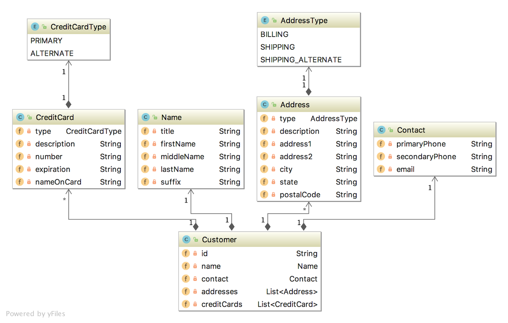
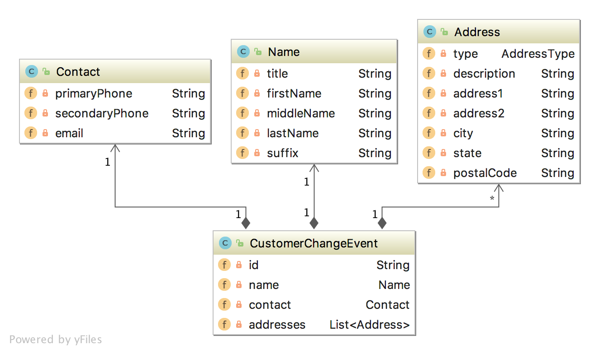

# Getting Started

### Description
About Storefront Account Service

Accounts Service (ref.https://itnext.io/eventual-consistency-with-spring-for-apache-kafka-cfbbed450b5e)
The Accounts service is responsible for managing basic customer information, such as name, contact information, addresses, and credit cards for purchases. A partial view of the data model for the Accounts service is shown below. This cluster of domain objects represents the Customer Account Aggregate.

The Accounts service contains a CustomerChangeEvent class. As a Kafka producer, the Accounts service uses the CustomerChangeEvent domain event object to carry state information about the client the Accounts service wishes to share when a new customer is added, or a change is made to an existing customer. The CustomerChangeEvent object is not an exact duplicate of the Customer object. For example, the CustomerChangeEvent object does not share sensitive credit card information with other message Consumers (the CreditCard data object).

### Reference Documentation

For further reference, please consider the following sections:

* [Annotations for JVM-based languages](https://github.com/JetBrains/java-annotations)
  - A set of Java annotations which can be used in JVM-based languages. They serve as an additional documentation and can be interpreted by IDEs and static analysis tools to improve code analysis.
* [Official Apache Maven documentation](https://maven.apache.org/guides/index.html)
* [Spring Boot Maven Plugin Reference Guide](https://docs.spring.io/spring-boot/docs/2.7.2/maven-plugin/reference/html/)
* [Create an OCI image](https://docs.spring.io/spring-boot/docs/2.7.2/maven-plugin/reference/html/#build-image)
* [Spring Boot DevTools](https://docs.spring.io/spring-boot/docs/2.7.2/reference/htmlsingle/#using.devtools)
* [Spring for Apache Kafka](https://docs.spring.io/spring-boot/docs/2.7.2/reference/htmlsingle/#messaging.kafka)
* [Sleuth](https://docs.spring.io/spring-cloud-sleuth/docs/current/reference/htmlsingle/spring-cloud-sleuth.html)
  - [Sending Spans to Zipkin](https://cloud.spring.io/spring-cloud-sleuth/2.1.x/multi/multi__sending_spans_to_zipkin.html)
    By default, if you add spring-cloud-starter-zipkin as a dependency to your project, when the span is closed, it is sent to Zipkin over HTTP. The communication is asynchronous. You can configure the URL by setting the spring.zipkin.baseUrl property,
* [Spring Boot Actuator](https://docs.spring.io/spring-boot/docs/2.7.2/reference/htmlsingle/#actuator)
* [Rest Repositories](https://docs.spring.io/spring-boot/docs/2.7.2/reference/htmlsingle/#howto.data-access.exposing-spring-data-repositories-as-rest)
* [Spring Data MongoDB](https://docs.spring.io/spring-boot/docs/2.7.2/reference/htmlsingle/#data.nosql.mongodb)

### Guides

The following guides illustrate how to use some features concretely:

* [Building a RESTful Web Service with Spring Boot Actuator](https://spring.io/guides/gs/actuator-service/)
* [Accessing JPA Data with REST](https://spring.io/guides/gs/accessing-data-rest/)
* [Accessing Neo4j Data with REST](https://spring.io/guides/gs/accessing-neo4j-data-rest/)
* [Accessing MongoDB Data with REST](https://spring.io/guides/gs/accessing-mongodb-data-rest/)
* [Accessing Data with MongoDB](https://spring.io/guides/gs/accessing-data-mongodb/)

