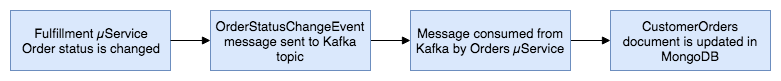

# Getting Started

### Description

* Fulfillment Service (ref.https://itnext.io/eventual-consistency-with-spring-for-apache-kafka-cfbbed450b5e)
  

* Fulfillment Order Status State Change
  When the Order status in a Fulfillment entity is changed to anything other than Approved, an OrderStatusChangeEvent message is produced by the Fulfillment service and sent to the fulfillment.order.change Kafka topic. This message is retrieved and consumed by the Orders service. This is how the Orders service tracks all CustomerOrder lifecycle events from the initial Created status to the final Received status.
  
  States: (start)Create & Approved -> Processing -> Shipped -> In Transit -> Received(end)
  The Fulfillment service exposes several endpoints via the FulfillmentController class, which simulates a change in order status. They allow an order’s status to be changed from Approved to Processing, to Shipped, to In Transit, and finally to Received. This change applies to all orders that meet the criteria.

### Reference Documentation

For further reference, please consider the following sections:

* [Official Apache Maven documentation](https://maven.apache.org/guides/index.html)
* [Spring Boot Maven Plugin Reference Guide](https://docs.spring.io/spring-boot/docs/2.7.2/maven-plugin/reference/html/)
* [Create an OCI image](https://docs.spring.io/spring-boot/docs/2.7.2/maven-plugin/reference/html/#build-image)
* [Spring Web](https://docs.spring.io/spring-boot/docs/2.7.2/reference/htmlsingle/#web)

### Guides

The following guides illustrate how to use some features concretely:

* [Building a RESTful Web Service](https://spring.io/guides/gs/rest-service/)
* [Serving Web Content with Spring MVC](https://spring.io/guides/gs/serving-web-content/)
* [Building REST services with Spring](https://spring.io/guides/tutorials/rest/)

