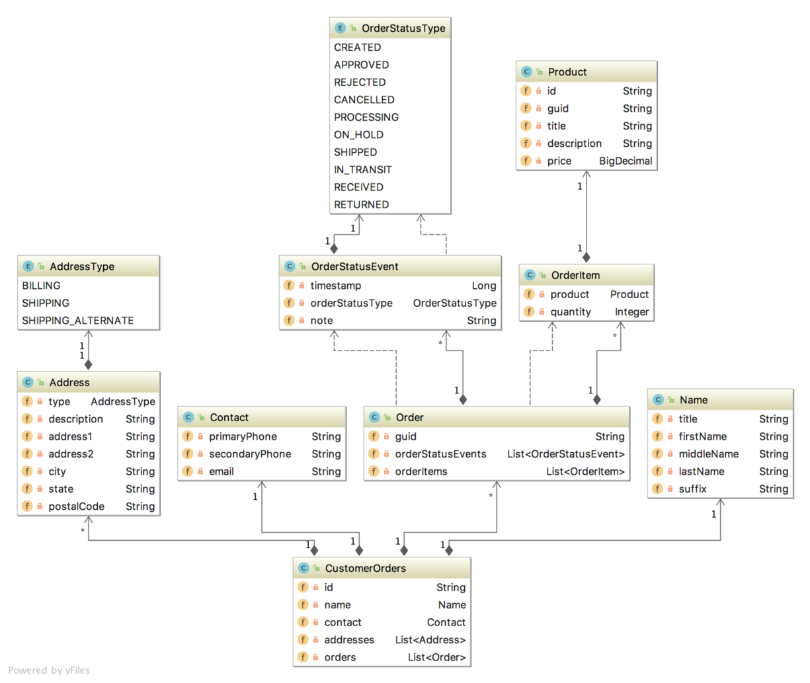
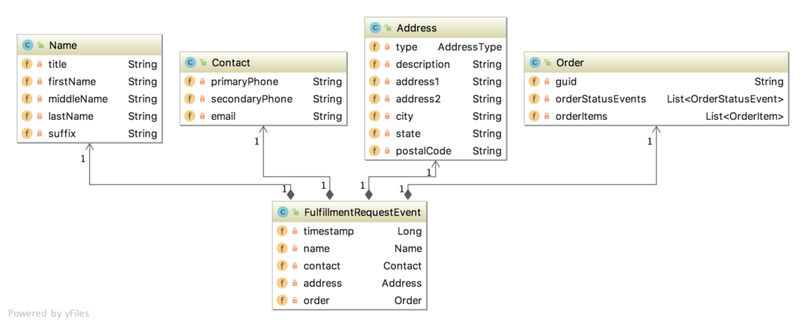

# Getting Started

### Description
About Storefront Orders Service

Orders Service (ref.https://itnext.io/eventual-consistency-with-spring-for-apache-kafka-cfbbed450b5e)
The Orders service is responsible for managing basic order information, ......

The Accounts service contains a FulfillmentRequestEvent class. As a Kafka producer, the Orders service uses .........

### Run & Test

* Test 
  - 1.Produce the data 
    - By manual(without Accounts services)  - 
      {"id":"62e9fc5f0a61eb396938587e","name":{"title":"Ms.","firstName":"Susan","middleName":null,"lastName":"Blackstone","suffix":null},"contact":{"primaryPhone":"433-544-6555","secondaryPhone":"223-445-6767","email":"susan.m.blackstone@emailisus.com"},"addresses":[{"type":"BILLING","description":"My CC billing address","address1":"33 Oak Avenue","address2":null,"city":"Nowhere","state":"VT","postalCode":"444556-9090"},{"type":"SHIPPING","description":"Home Sweet Home","address1":"33 Oak Avenue","address2":null,"city":"Nowhere","state":"VT","postalCode":"444556-9090"}]}
    - By Accounts services
      http http://localhost:8085/customers/sample
  - 2.orders receive the data from customer.change topic
  - 3.create order(It is necessary that there is a customer data - 'Susan' in the order collection.) - 
      http://localhost:8090/customers/sample/orders
  - 4.send approved orders to fulfillment service - http http://localhost:8090/customers/sample/fulfill
  - 5.check orders.order.fulfill topic

### Reference Documentation

For further reference, please consider the following sections:

* [Official Apache Maven documentation](https://maven.apache.org/guides/index.html)
* [Spring Boot Maven Plugin Reference Guide](https://docs.spring.io/spring-boot/docs/2.7.2/maven-plugin/reference/html/)
* [Create an OCI image](https://docs.spring.io/spring-boot/docs/2.7.2/maven-plugin/reference/html/#build-image)
* [Spring Web](https://docs.spring.io/spring-boot/docs/2.7.2/reference/htmlsingle/#web)

### Guides

The following guides illustrate how to use some features concretely:

* [Building a RESTful Web Service](https://spring.io/guides/gs/rest-service/)
* [Serving Web Content with Spring MVC](https://spring.io/guides/gs/serving-web-content/)
* [Building REST services with Spring](https://spring.io/guides/tutorials/rest/)

